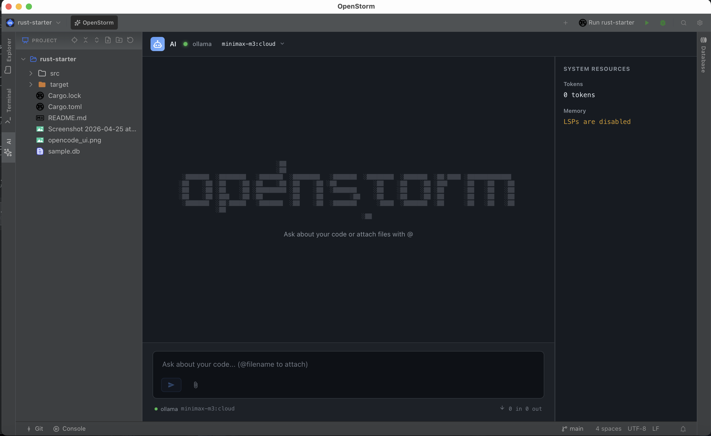
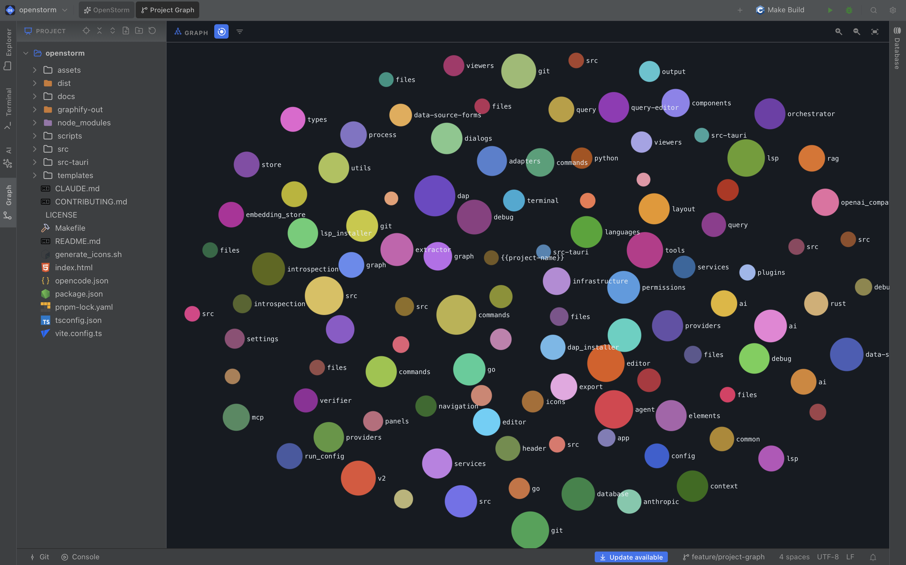
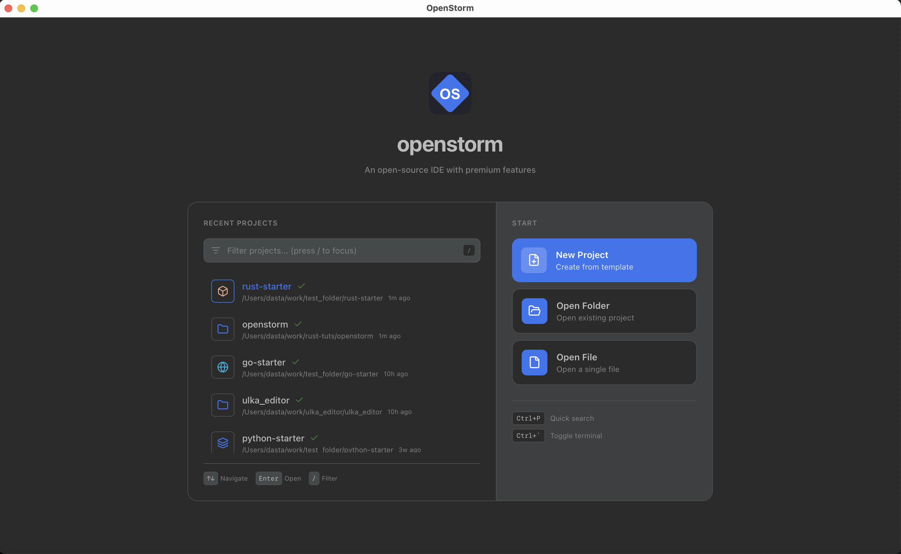
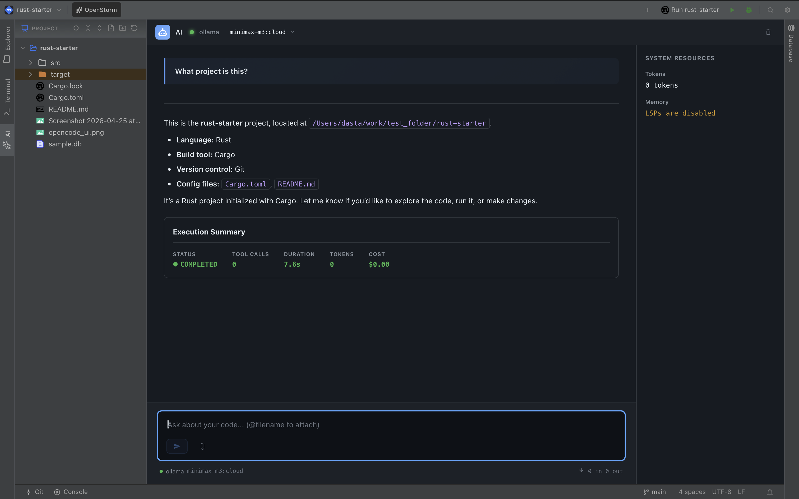
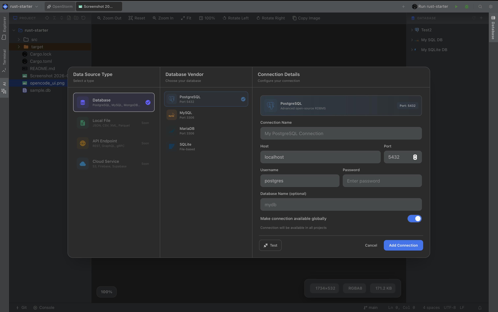
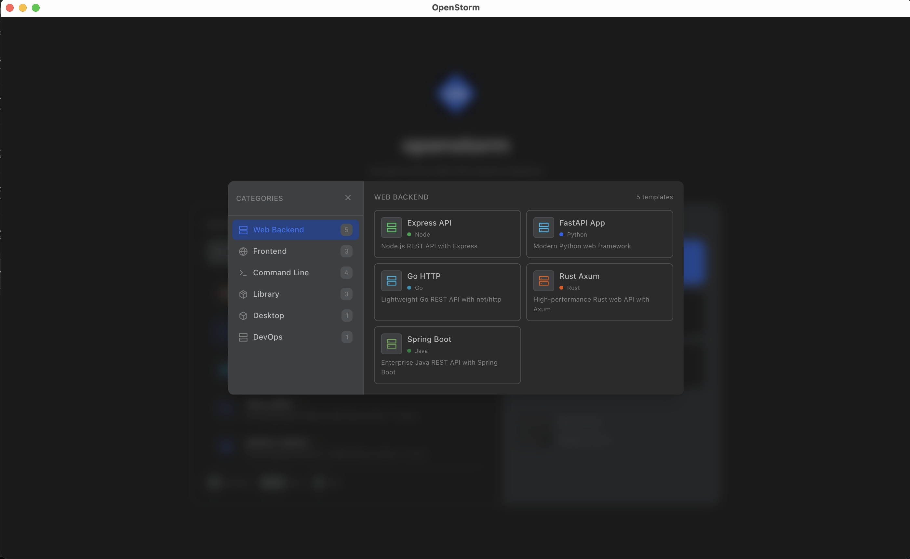
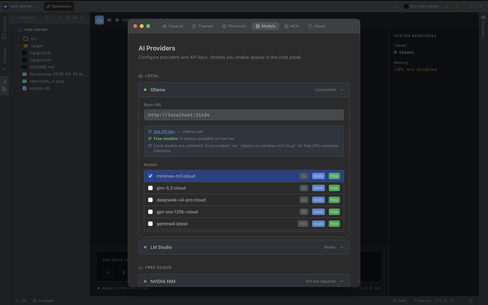

<p align="center">
  
</p>

<h1 align="center">OpenStorm</h1>

<p align="center">
  <strong>The free, fast, feature-rich IDE — built in Rust</strong>
</p>

<p align="center">
  <a href="https://github.com/Dastagirireddy/openstorm/blob/main/LICENSE"></a>
  <a href="https://github.com/Dastagirireddy/openstorm/stargazers"></a>
  <a href="https://github.com/Dastagirireddy/openstorm/releases"></a>
  
</p>

<p align="center">
  Code, debug, query databases, and build with AI — without switching apps or paying subscriptions.
</p>

---

## What is OpenStorm?

OpenStorm is an open-source IDE built in Rust with Tauri. It combines the tools developers use daily — editor, terminal, git, debugger, database client, and AI — into one native application. No Electron. No subscription fees. No extension hunting.

**Your AI, your keys.** Connect to any provider — Ollama, OpenAI, Anthropic, DeepSeek, or any OpenAI-compatible API. Run local models for free or use cloud models with your own API keys.

---

## Install

### Linux

| Format | Architecture | Link |
|--------|-------------|------|
| `.deb` | x64 | [Download](https://github.com/Dastagirireddy/openstorm/releases/latest) |
| `.deb` | arm64 | [Download](https://github.com/Dastagirireddy/openstorm/releases/latest) |
| AppImage | x64 / arm64 | [Download](https://github.com/Dastagirireddy/openstorm/releases/latest) |

```bash
# Debian / Ubuntu
sudo dpkg -i openstorm_*.deb

# AppImage
chmod +x OpenStorm_*.AppImage && ./OpenStorm_*.AppImage
```

### macOS

Coming soon. Build from source in the meantime:

```bash
git clone https://github.com/Dastagirireddy/openstorm.git
cd openstorm
pnpm install
pnpm tauri build
```

### Build from Source

```bash
# Prerequisites: Rust, Node.js, pnpm
git clone https://github.com/Dastagirireddy/openstorm.git
cd openstorm
pnpm install
pnpm tauri dev      # Development mode
pnpm tauri build    # Production build
```

---

## Project Graph

<p align="center">
  
</p>

Visualize your entire codebase as an interactive graph. Open the Graph tab to explore project structure, dependencies, and relationships.

### How It Works

When you open a project, OpenStorm **automatically builds a code graph** in the background:

1. **Auto-Indexing** — On first project open, scans all source files (Rust, TypeScript, Python, Go)
2. **SQLite Storage** — Graph stored in `.openstorm/graph.db` for fast queries
3. **Incremental Updates** — File watcher keeps the graph in sync as you code
4. **Status Bar Progress** — See indexing status without blocking your workflow

### Graph Features

| Feature | Description |
|---------|-------------|
| **Community Detection** | Louvain algorithm groups related code into color-coded clusters |
| **Layout Toggle** | Switch between Force (clustered) and Hierarchical (tree) layouts |
| **Folder Filtering** | Filter nodes by folder to focus on specific modules |
| **Node Types** | Functions, Structs, Enums, Traits, Imports — each with distinct colors |
| **Expand/Collapse** | Click folders to drill into files, click files to see functions |
| **Double-Click** | Navigate directly to the source file and line |
| **Zoom Controls** | Zoom in/out, fit to screen via toolbar |

### Architecture

```
┌─────────────────────────────────────────────────────────────┐
│  Frontend (sigma-container.ts)                              │
│  • Sigma.js v3 with WebGL rendering                        │
│  • Louvain community detection + iwanthue colors            │
│  • ForceAtlas2 / Dagre layout engines                       │
│  • Level-of-Detail (LOD) manager for hierarchy              │
└────────────────────┬────────────────────────────────────────┘
                     │ Tauri IPC
┌────────────────────┴────────────────────────────────────────┐
│  Backend (build_project.rs, graph_watcher.rs)               │
│  • Tree-sitter extractors (Rust, TS, Python, Go)            │
│  • SQLite graph store (.openstorm/graph.db)                 │
│  • Real-time file watcher for incremental updates           │
└─────────────────────────────────────────────────────────────┘
```

---

## Graph RAG (Retrieval-Augmented Generation)

OpenStorm uses a **Graph-augmented RAG** system that gives the AI agent deep understanding of your codebase structure.

### How Graph RAG Works

```
┌─────────────────────────────────────────────────────────────┐
│  User Query                                                 │
│       │                                                     │
│       ▼                                                     │
│  ┌─────────────────┐                                        │
│  │ Search Nodes    │ ← BM25 full-text search on node names  │
│  └────────┬────────┘                                        │
│           │                                                 │
│           ▼                                                 │
│  ┌─────────────────┐                                        │
│  │ BFS Traversal   │ ← Find neighbors up to depth 2         │
│  └────────┬────────┘                                        │
│           │                                                 │
│           ▼                                                 │
│  ┌─────────────────┐                                        │
│  │ Rank & Budget   │ ← Score by connectivity, fit in tokens │
│  └────────┬────────┘                                        │
│           │                                                 │
│           ▼                                                 │
│  ┌─────────────────┐                                        │
│  │ Build Context   │ ← Nodes + Edges → LLM prompt           │
│  └─────────────────┘                                        │
└─────────────────────────────────────────────────────────────┘
```

### RAG Pipeline

| Step | Description |
|------|-------------|
| **1. Query** | User asks a question (e.g., "How does auth work?") |
| **2. Search** | BM25 search finds matching nodes (functions, structs, etc.) |
| **3. Traverse** | BFS traversal finds related code up to 2 hops away |
| **4. Rank** | Nodes scored by connectivity — more connected = more relevant |
| **5. Budget** | Select top nodes within token budget (default: 2000 tokens) |
| **6. Context** | Build graph context with nodes, edges, and relationships |
| **7. Prompt** | Inject context into LLM system prompt |

### What the AI Sees

When Graph RAG is enabled, the AI receives:

```
Relevant code from "auth" query:
├── Function: authenticate_user (src/auth.rs:45)
│   ├── Calls: validate_token (src/auth.rs:78)
│   ├── Calls: hash_password (src/crypto.rs:12)
│   └── Implements: AuthProvider trait (src/auth.rs:23)
├── Struct: UserSession (src/auth.rs:15)
│   ├── Uses: Redis client (src/db/redis.rs)
│   └── References: User model (src/models/user.rs)
└── Edge: authenticate_user → UserSession (Creates)
```

### Fallback Behavior

| Condition | Behavior |
|-----------|----------|
| Graph exists | Uses Graph RAG (structured context) |
| Graph not built | Falls back to BM25 RAG (embedding search) |
| No graph store | Uses basic file search |

### Supported Languages

| Language | Extractors |
|----------|-----------|
| Rust | Functions, Structs, Enums, Traits, Impl blocks, Imports |
| TypeScript | Functions, Classes, Interfaces, Types, Imports |
| Python | Functions, Classes, Imports |
| Go | Functions, Structs, Interfaces, Imports |

---

## Features

### Code Editor

<p align="center">
  
</p>

Built on CodeMirror 6 with full Language Server Protocol (LSP) support:

- **Autocomplete** — IntelliSense-style completions for Rust, Go, Python, C/C++, TypeScript
- **Go to Definition** — Jump to any symbol across your project
- **Hover Information** — Type info and docs on hover
- **Code Formatting** — Format on save or on demand via LSP
- **Syntax Highlighting** — Language-aware colors for 20+ languages
- **Find & Replace** — IntelliJ-style search panel with regex support
- **Code Folding** — Collapse functions, blocks, and regions
- **Scope Lines** — Visual indent guides based on syntax tree

### AI Agent

<p align="center">
  
</p>

Built-in AI assistant with tool execution — read files, search code, run commands, and more:

- **Chat** — Ask questions about your code, get explanations, generate code
- **Tool Execution** — AI can read files, search code, run terminal commands
- **File Editing** — AI proposes changes with diff preview before applying
- **Sub-Agent Orchestration** — Complex tasks decomposed into parallel sub-tasks
- **Streaming Responses** — Real-time token-by-token output
- **Permission System** — Approve or deny each tool call before execution
- **Execution Timeline** — Visual timeline of agent steps and decisions

**Supported Providers:**

| Type | Providers |
|------|-----------|
| **Local** | Ollama, LM Studio |
| **Free Cloud** | NVIDIA NIM, OpenRouter, DeepSeek, Qwen, Groq, SambaNova, Together, Mistral, Cerebras, Fireworks |
| **Paid Cloud** | OpenAI, Anthropic, Google |

### Database Client

<p align="center">
  
</p>

Connect to databases without leaving the editor:

- **PostgreSQL** — Full introspection, schema browsing, query execution
- **MySQL / MariaDB** — Complete support with schema explorer
- **SQLite** — Browse and query local database files
- **MongoDB** — Document browsing and queries
- **Redis** — Key inspection and operations
- **Query Editor** — SQL editor with syntax highlighting, result tables, JSON view
- **Saved Queries** — Save and reuse frequently run queries
- **Schema Browser** — Navigate tables, columns, indexes across connections

### Integrated Terminal

Full PTY terminal emulator with split-pane support:

- **Multiple Instances** — Run several terminals simultaneously
- **Split Panes** — Split horizontally or vertically
- **Native PTY** — Real terminal via `portable-pty`, not a web mock
- **Theme-Aware** — Terminal colors match your IDE theme
- **CWD Tracking** — Terminal follows your file navigation

### Git Integration

Complete git workflow built in:

- **Branch Management** — Create, switch, delete branches
- **Staging** — Stage/unstage individual files or all
- **Commit** — Commit with message, amend previous commits
- **Diff View** — See changes before committing
- **Push / Pull / Fetch** — Remote sync with branch selection
- **Commit History** — Browse log with search and file history
- **GitHub PRs** — View pull requests directly in the IDE
- **Breakpoint Persistence** — Breakpoints saved per project

### Debugging

Built-in Debug Adapter Protocol (DAP) support:

- **Breakpoints** — Set breakpoints with conditions
- **Step Through** — Step over, step into, step out
- **Variable Inspector** — View local and global variables
- **Watch Expressions** — Monitor values in real-time
- **Call Stack** — Navigate the execution stack
- **Debug Console** — Evaluate expressions during debug
- **Auto-Install** — Debug adapters installed automatically

**Supported Debuggers:**

| Language | Adapter |
|----------|---------|
| Rust, C, C++, Swift | LLDB |
| JavaScript, TypeScript | Node.js / V8 |
| Go | Delve |

### Project Templates

<p align="center">
  
</p>

Start new projects instantly from 17 built-in templates:

| Category | Templates |
|----------|-----------|
| **Web Backend** | Rust Axum, Express API, FastAPI, Go HTTP, Java Spring |
| **Frontend** | React Vite, Vue Vite, Next.js |
| **CLI** | Rust CLI, Node CLI, Python CLI, Go CLI |
| **Library** | Rust Lib, TypeScript Lib, Python Package |
| **Desktop** | Tauri App |
| **DevOps** | Docker Compose |

Each template includes pre-configured files, dependencies, and a ready-to-run project structure.

### Theming

<p align="center">
  
</p>

Customize every pixel with 100+ CSS variables:

- **3 Built-in Themes** — OpenStorm Light, OpenStorm Dark, VS Code Dark+
- **Quick Switcher** — `Cmd+Shift+T` to switch themes instantly
- **Separate Themes** — Workbench and editor themes can be different
- **System Detection** — Automatically follows OS light/dark mode
- **Plugin Themes** — Install custom themes from the community

---

## Roadmap

| Phase | Features | Status |
|-------|----------|--------|
| **v1.3** | Editor, AI Chat, Database, Git, Terminal, Templates, Theming | Current |
| **v1.4** | AI Agent Mode — autonomous multi-file editing with permission system | In Progress |
| **v1.5** | Built-in Kanban board, Diagram editor (Mermaid + custom), Collaboration tools | Planned |
| **v2.0** | Plugin marketplace, Cloud sync, Team workspaces | Future |

---

## AI Provider Configuration

<p align="center">
  
</p>

OpenStorm uses a **Bring Your Own Key (BYOK)** model. You connect to whichever AI provider you prefer:

- **Local models** — Run Ollama or LM Studio for free, unlimited usage
- **Free cloud** — NVIDIA NIM, OpenRouter, DeepSeek, and others offer free tiers
- **Paid cloud** — Use your own API keys for OpenAI, Anthropic, Google

No subscriptions. No credit systems. Pay only for what you use, directly to the provider.

---

## Keyboard Shortcuts

| Shortcut | Action |
|----------|--------|
| `Cmd+P` | Quick file search |
| `Cmd+Shift+T` | Switch theme |
| `Cmd+Shift+N` | New project |
| `Cmd+F` | Find in file |
| `Cmd+R` | Find and replace |
| `Ctrl+`` ` | Toggle terminal |
| `Cmd+S` | Save file |
| `Cmd+Shift+F` | Search across files |

---

## Built With

| Layer | Technology |
|-------|-----------|
| **Backend** | Rust, Tauri v2, Tokio |
| **Frontend** | TypeScript, Lit, Tailwind CSS |
| **Editor** | CodeMirror 6 |
| **Terminal** | xterm.js, portable-pty |
| **AI** | OpenAI-compatible API, MCP protocol |
| **Graph** | SQLite, Tree-sitter, Sigma.js, Graphology |
| **RAG** | Graph-augmented RAG, BM25 search, Louvain communities |
| **Database** | sqlx (Postgres, MySQL, SQLite), mongodb, redis |
| **Git** | git2-rs |
| **Debugging** | DAP (Debug Adapter Protocol) |

---

## Contributing

OpenStorm is open source and welcomes contributions. Whether it's bug fixes, new features, or documentation — every contribution helps.

1. Fork the repository
2. Create a feature branch (`git checkout -b feature/amazing-feature`)
3. Commit your changes (`git commit -m 'Add amazing feature'`)
4. Push to the branch (`git push origin feature/amazing-feature`)
5. Open a Pull Request

See [CONTRIBUTING.md](CONTRIBUTING.md) for detailed guidelines.

---

## License

[MIT](LICENSE) — Free to use, modify, and distribute.
